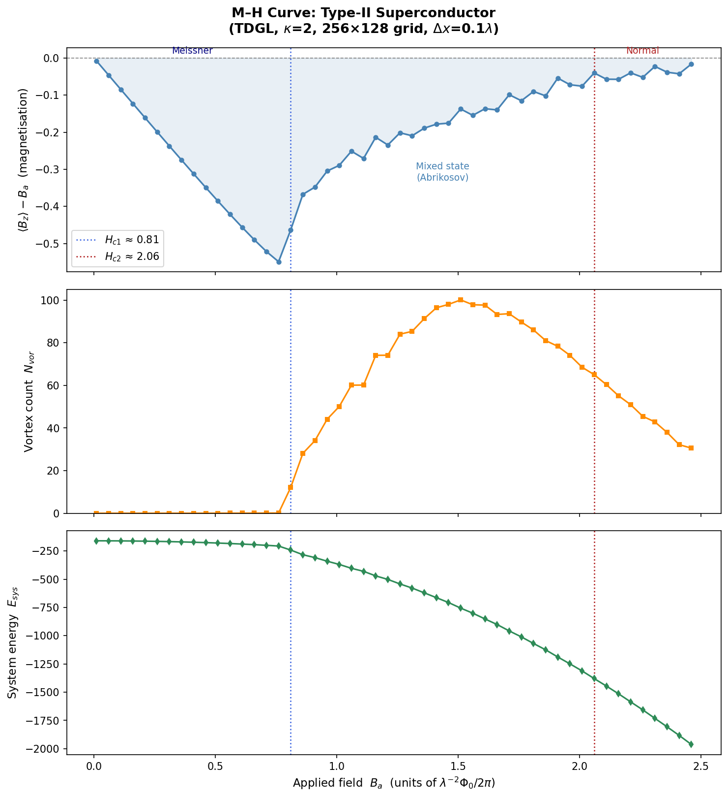

# GPU TDGL Solver

CUDA solver for the Time-Dependent Ginzburg-Landau (TDGL) equations,
modernised for NVIDIA RTX 5090 (Blackwell, sm_120).

Algorithm: W. D. Gropp et al., *J. Comput. Phys.* **123**, 254 (1996).  
Original code: CUDA Toolkit 3.2, 2011. This rewrite targets CUDA 12 / sm_120.

---

## Background — what this solves

### The physics

A **type-II superconductor** placed in a magnetic field does not simply expel the
field (the Meissner state) or go normal. Above a lower critical field **Hc1**, the
field penetrates the sample as a lattice of quantized **vortices** — tiny tubes of
normal material each carrying one flux quantum, surrounded by a circulating
supercurrent. As the field rises, more vortices enter, arranging themselves into a
triangular **Abrikosov lattice**, until at the upper critical field **Hc2** the
vortex cores overlap and superconductivity is destroyed. How vortices nucleate at
the edge, overcome the **Bean–Livingston surface barrier**, move, pin on defects,
and pack into a lattice governs the magnetic and transport properties of every
practical superconductor (magnets, cables, RF cavities).

These dynamics have no closed-form solution. The standard way to study them is to
integrate the **Time-Dependent Ginzburg-Landau (TDGL) equations** — coupled PDEs
for the complex superconducting order parameter ψ(x,y,t) and the magnetic vector
potential A(x,y,t) — forward in time on a grid until the system relaxes to
equilibrium at each applied field. This solver uses the **gauge-invariant
link-variable discretisation** of Gropp et al. (1996), which preserves gauge
invariance exactly on the lattice (see `docs/TDGL_paper.md` for the full
derivation).

### What this repository does

It computes the **magnetisation curve (M–H loop)** and the full spatial structure
of a 2-D type-II superconductor as an external field is swept, by time-stepping the
discrete TDGL equations on the GPU. Concretely, for each applied field Ba it:

1. relaxes ψ and A to equilibrium (explicit forward-Euler time stepping),
2. records the magnetisation, vortex count, and free energy, and
3. dumps the order parameter |ψ|, induced field Bz, and supercurrent Js maps.

From these you can see vortex entry at Hc1, the Abrikosov lattice in the mixed
state, and the transition to the normal state at Hc2 — and quantify them
(M–H curve, vortex positions, hexatic order). See **Results** below.

### Why a GPU rewrite

The TDGL update is a memory-bound, nearest-neighbour stencil applied to a large
grid over millions of timesteps — an ideal fit for a GPU. The original 2011 code
targeted the long-obsolete CUDA Toolkit 3.2 and Fermi-era hardware. This repository
**modernises it for CUDA 12 and NVIDIA Blackwell (RTX 5090, sm_120)**, applying ten
CUDA optimisations (coalesced layout, shared-memory stencil tiling, kernel fusion,
dual streams, CUDA Graphs, Blackwell L2 persistence…) to reach **~44 µs/step on a
256×128 grid**. See `docs/OPTIMIZATION.md`.

---

## Results

Zero-field-cooled (ZFC) M-H sweep on a 256×128 grid (DX=0.1λ, κ=2),
Ba = 0.01 → 2.5 in steps of 0.05.



Vortex entry begins at Hc1 ≈ 0.81 (Bean-Livingston barrier),
Abrikosov lattice forms in the mixed state, normal state reached at Hc2 ≈ 1.81.

---

## Project layout

```
TDGL/
├── include/
│   ├── params.hpp        ← ALL tuneable parameters (NX, DX, KAPPA, DT …)
│   ├── host_tdgl.hpp     ← host-side data container and file I/O
│   ├── cuda_check.hpp    ← CUDA_CHECK macro
│   └── complex_ops.cuh   ← inline double-precision complex arithmetic
├── src/
│   ├── main.cu           ← entry point; sweep range set via SimConfig::make()
│   ├── kernels.cu/cuh    ← all CUDA kernels
│   ├── memory.cu/hpp     ← device allocation and constant upload
│   └── simulation.cu/hpp ← benchmark and simulation loops
├── scripts/
│   ├── plot_mh.py        ← M-H curve plot
│   ├── plot_fields.py    ← spatial field maps
│   └── analyze_vortex.py ← vortex detection and lattice order
├── figures/              ← output PNG plots and CSV
├── docs/
│   ├── TDGL_paper.md     ← physics background and equations
│   └── OPTIMIZATION.md   ← CUDA optimisation details
├── agents/
│   ├── tdgl-run/         ← agent: how to build and run
│   └── tdgl-analysis/    ← agent: how to analyse and plot results
├── CMakeLists.txt
├── Makefile
└── README.md
```

---

## Build

```bash
make -j$(nproc)    # requires CUDA 12+ and nvcc
make profile       # Nsight Systems profile → tdgl_profile.nsys-rep
make clean
```

Compiler flags applied automatically:
- `-arch=sm_120 --generate-code arch=compute_120,code=sm_120`
- `-O3 --use_fast_math --extended-lambda --extra-device-vectorization`

For other GPUs change `ARCH` in the Makefile:

| GPU | ARCH |
|-----|------|
| RTX 5090 (Blackwell GB202) | `sm_120` |
| RTX 4090 (Ada Lovelace) | `sm_89` |
| RTX 3090 / A100 (Ampere) | `sm_86` / `sm_80` |
| RTX 2080 (Turing) | `sm_75` |

---

## Configure

### Physics and grid — `include/params.hpp`

| Parameter | Symbol | Default | Meaning |
|-----------|--------|---------|---------|
| `NX`, `NY` | — | 255, 127 | Grid nodes (sample = (NX+1)·DX × (NY+1)·DY) |
| `DX`, `DY` | Δx, Δy | 0.1 λ | Grid spacing in units of London depth λ |
| `KAPPA` | κ = λ/ξ | 2.0 | GL parameter (κ > 1/√2 → Type II) |
| `DT` | Δt | 2×10⁻³ | Timestep — **must satisfy DT ≤ DX²/2** |
| `SIGMA` | σ | 1.0 | Normal-state conductivity |

Physical sample size at defaults: **25.6λ × 12.8λ**  
Vortex core radius: ξ = λ/κ = 0.5λ = 5 grid points at DX=0.1

**DT stability guide:**

| DX | Max DT |
|----|--------|
| 0.05 | 1.25×10⁻³ |
| 0.1 | 5×10⁻³ |
| 0.2 | 2×10⁻² |

### Sweep range — `src/main.cu`

```cpp
const SimConfig cfg = SimConfig::make(
    /*sBa*/    0.01,   // start field
    /*eBa*/    2.50,   // end field
    /*stepBa*/ 0.05,   // field increment
    /*SAMPLE*/ 100     // steps between convergence checks
);
```

Convergence is declared when |ΔMag| < 10⁻⁴ for 5 consecutive checks.

---

## Run

```bash
./tdgl
```

All output files are written to the **current directory**:

| File | Content |
|------|---------|
| `Mag.dat` | Per-step summary: `Ba  Mag  NumVor  SysEng` |
| `Psi{idx}_{step}.dat` | Order parameter \|ψ(x,y)\| at convergence |
| `Bz{idx}_{step}.dat` | Induced field Bz(x,y) at convergence |
| `Jsx/Jsy{idx}_{step}.dat` | Supercurrent density at convergence |

File index: `idx = round(100 × Ba)`, reconstructed as `Ba = idx × 0.01`.

---

## Analyse results

```bash
# M-H curve
python3 scripts/plot_mh.py --data Mag.dat --out figures/mh_curve.png

# Spatial field maps for selected Ba values
python3 scripts/plot_fields.py --data . --ba 0.81 1.01 1.51 --field both --out figures/field_maps.png

# Full gallery of all Ba steps
python3 scripts/plot_fields.py --data . --all --field psi --out figures/psi_gallery.png

# Vortex positions, density, and hexatic order
python3 scripts/analyze_vortex.py --data . --out-dir figures
```

For a complete automated analysis workflow see `agents/tdgl-analysis/AGENT.md`.  
For build/run instructions for AI agents see `agents/tdgl-run/AGENT.md`.  
Physics background and equations: `docs/TDGL_paper.md`.

---

## CUDA optimisations

| # | Technique | Impact |
|---|-----------|--------|
| 1 | Row-major coalesced memory layout | ★★★ |
| 2 | `__constant__` memory for physics scalars | ★★ |
| 3 | Shared-memory stencil tile (bank-conflict-free, 34-wide) | ★★★ |
| 4 | Kernel fusion (dΨ/dt + dU/dt in one pass) | ★★★ |
| 5 | Pinned host memory (`cudaHostAlloc`) | ★★ |
| 6 | Dual CUDA streams (compute ∥ D→H transfer) | ★★ |
| 7 | 3 memory pools → 3 `cudaMalloc` calls | ★ |
| 8 | L2 cache persistence window (Blackwell sm_120+) | ★★ |
| 9 | Max shared-memory carveout for derivative kernel | ★★ |
| 10 | CUDA Graphs (measured in benchmark loop) | +5–25% |

See `docs/OPTIMIZATION.md` for full details.

---

## Benchmark (RTX 5090, sm_120)

```
Grid: 256×128  (32 768 pts)
Without CUDA Graphs : ~47.6 µs/step
With    CUDA Graphs : ~44.5 µs/step   (+7% speedup)
```

---

## Physics background

See `docs/TDGL_paper.md` for the full derivation of the gauge-invariant TDGL equations
and the link-variable discretisation scheme used in this solver.
